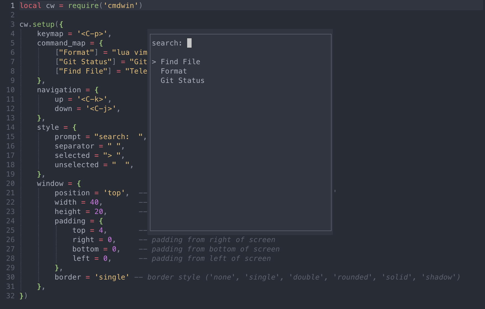

# cmdwin.nvim
A neovim extanstion for applaying commands that you don't want shortcuts for. 
It works similar to the `Ctrl-Shift-P` in VSCode.

The point of this plugin is that it allows you to map a keyword to a command 
so that you do not need to have a weird keymapping for it that you won’t remember.

> This is quite a new extension, so it might have some bugs.
> If you find any bugs, please report them on the [github issues page](https://github.com/AxelGard/cmdwin.nvim/issues).



## Install 

packer
```lua
use('AxelGard/cmdwin.nvim')
```

### setup

minimal setup:
```lua
require('cmdwin').setup({
    keymap = '<leader>p',
    command_map = {
        ["Find File"] = "Telescope find_files",
        ["Git Status"] = "Git",
        ["Format"] = "lua vim.lsp.buf.format()",
        -- ... more commands ...
    },
})
```

Full custom setup:
```lua
require('cmdwin').setup({
    keymap = '<C-p>',
    command_map = {
        ["Format"] = "lua vim.lsp.buf.format()",
        ["Git Status"] = "Git",
        ["Find File"] = "Telescope find_files",
        ["Equal Buff"] = 'lua vim.api.nvim_feedkeys(vim.api.nvim_replace_termcodes("<C-w>=", true, true, true), "n", true)', -- use key commands such as <C-w>=

    },
    navigation = {
        up = '<C-k>',
        down = '<C-j>',
    },
    style = {
        prompt = "search:  ",
        separator = " ",
        selected = "> ",
        unselected = "  ",
    },
    window = {
        position = 'top',  -- 'center', 'top', 'bottom', 'left', 'right'
        width = 40,        -- custom width
        height = 20,       -- custom height
        padding = {
            top = 4,       -- padding from top of screen
            right = 0,     -- padding from right of screen
            bottom = 0,    -- padding from bottom of screen
            left = 0,      -- padding from left of screen
        },
        border = 'single' -- border style ('none', 'single', 'double', 'rounded', 'solid', 'shadow')
    },
})
``` 
You can find my own my one cmdwin config [here](https://github.com/AxelGard/dotfiles/blob/main/.config/nvim/lua/axel/plugins/cmdwin.lua).
